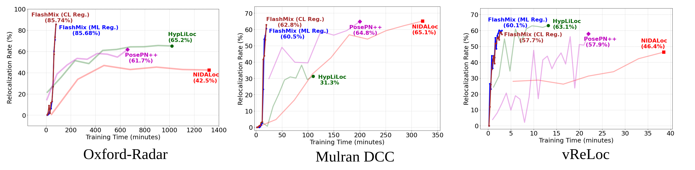
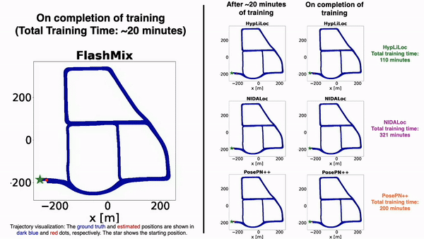
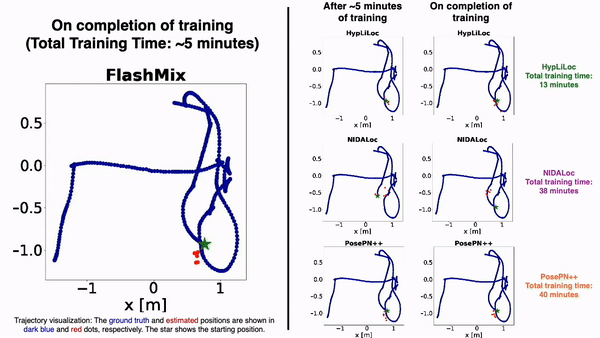

# FlashMix: Fast Map-Free LiDAR Localization via Feature Mixing and Contrastive-Constrained Accelerated Training

📖 Paper (To appear): [`WACV 2025`]()

📖 Pre-print: [``arXiv``]()

📹 Video: [`Youtube`]()

#### Authors: Raktim Gautam Goswami, Naman Patel, Prashanth Krishnamurthy, Farshad Khorrami 

#### Control/Robotics Research Laboratory (CRRL), Department of Electrical and Computer Engineering, NYU Tandon School of Engineering

### 💡 Contributions
- A novel map-free localization framework combining a pre-trained point encoder with a scene-specific pose regressor with feature buffer enabled rapid training.
- Integration of an MLP-Mixer as a descriptor aggregator, to fuse global point relationships by feature mixing for adapting to scene-specific geometries.
- Introduce metric learning and contrastive loss regularization, enhancing global descriptor quality for stable convergence while maintaining fast training times.

- Extensive experiments in outdoor and indoor environments, demonstrating rapid training and adaptation with competitive performance compared to existing map-free localization methods.

<center>

<p><b>Fig. 1: Comparision of LiDAR pose regression-based framework (top) with our fast map-free LiDAR localization system.</b>b</p>
</center>

### 🔨 Environment creation

```bash
conda create --name flashmix python=3.10.11
conda activate flashmix
pip install numpy pyyaml opencv-python matplotlib
pip install torch --index-url https://download.pytorch.org/whl/cu121
pip install torch-scatter -f https://data.pyg.org/whl/torch-2.4.0+cu121.html
pip install torch-sparse -f https://data.pyg.org/whl/torch-2.4.0+cu121.html
pip install torch-cluster -f https://data.pyg.org/whl/torch-2.4.0+cu121.html
pip install -r requirements.txt
```
Install [SpTr](https://github.com/dvlab-research/SparseTransformer) from source.


### 📊💾  Dataset Setup

We support the [Oxford Radar RobotCar](https://oxford-robotics-institute.github.io/radar-robotcar-dataset/datasets), [vReLoc](https://github.com/loveoxford/vReLoc), and [Mulran DCC](https://sites.google.com/view/mulran-pr/download) datasets right now.


The data should be organized as follows: 

```
data_root
├-Oxford-Radar
|  ├-2019-01-11-14-02-26-radar-oxford-10k
|     ├-velodyne_left_False.h5
|     ├-velodyne_left
|  ├-2019-01-14-12-05-52-radar-oxford-10k
|  ├-2019-01-14-14-48-55-radar-oxford-10k 
|  ├-2019-01-15-13-06-37-radar-oxford-10k
|  ├-2019-01-17-13-26-39-radar-oxford-10k
|  ├-2019-01-17-14-03-00-radar-oxford-10k
|  ├-2019-01-18-14-14-42-radar-oxford-10k
|  ├-2019-01-18-15-20-12-radar-oxford-10k
├-vReLoc
|  ├-seq-03
|  ├-seq-05
|  ├-seq-06
|  ├-seq-07
|  ├-seq-12
|  ├-seq-14
|  ├-seq-15
|  ├-seq-16
├-Mulran/DCC
|  ├-DCC1
|  ├-DCC2
|  ├-DCC3
```
velodyne_left_False.h5 files can be generated using the data generator in [PosePN](https://github.com/PSYZ1234/PosePN). Alternately, we provide the pre-generated file [here]().

### 📊💾 Dataset Pickle Creation
```
cd src/utils/
python create_robotcar_pickle.py --data_dir <path_to_Oxford-Radar> --save_dir <path_to_save_pickle>
python create_dcc_pickle.py --data_dir <path_to_Oxford-Radar> --save_dir <path_to_save_pickle>
python create_vreloc_pickle.py --data_dir <path_to_Oxford-Radar> --save_dir <path_to_save_pickle>
```

### ✈️ Training
Navigate to the base, create a folder inside src named checkpoints to save the trained models.
```
mkdir -p src/checkpoints/FlashMix src/checkpoints/SALSA/Model 
```
Download pre-trained weights for the backbone (feat_extractor.pth) of [SALSA](https://github.com/raktimgg/SALSA/tree/main) from this [link](https://drive.google.com/drive/folders/1lehq0Hki75i7U_Twhd5uxxz37WvcRzGa) and save in src/checkpoints/SALSA/Model.

#### Start training
```
python src/main.py --dataset <robotcar or dcc or vReLoc>
```
The default config files for each dataset are located at src/config.

The trained models will be saved in the src/checkpoints/FlashMix directory.


### ✈️ Evaluation
```
python src/eval.py --dataset <robotcar or dcc or vReLoc>
```
Our pre-trained models can also be downloaded from this [link](). After downloading, copy the contents into the src/checkpoints/FlashMix directory.

### 📝 Results
The relocalization rates of the best-performing models as a function of training time are plotted below.
<center>

<p>Fig. 2: Analysis of relocalization rate as a function of train time</p>
</center>

### 🌈 Visualizations
<center> 
     
    <p><b>Fig. 3a: Oxford-Radar</b></p>
</center>

<br> <!-- Add space using line breaks -->

<center> 
     
    <p><b>Fig. 3b: Mulran DCC</b></p>
</center>

<br> <!-- Add space using line breaks -->

<center> 
     
    <p><b>Fig. 3c: vReLoc</b></p>
</center>
<br> <!-- Add space using line breaks -->
<center><b>Fig. 3: Visualization of different methods on test trajectories from Oxford-Radar, DCC, and vReLoC datasets. Trajectory visualization: The ground truth and estimated positions are shown in dark blue and red dots, respectively. The star shows the starting position.</b>b</center>


## 📧 Citation

If you find our work useful in your research please consider citing our publication:
```bibtex
